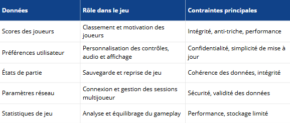

# C13 : Persistance des données

## 🔎 Observable 1 : Choix de persistance

Plusieurs types de données doivent être conservés afin d’assurer le bon fonctionnement de l’application, la continuité de l’expérience utilisateur et le respect des besoins fonctionnels du projet.

Les données persistées dans le jeu sont les suivantes :

	
	 <em>Données persistées du projet</em>

Cette phase d’identification permet de poser un cadre clair avant d’aborder les choix techniques liés aux solutions de persistance, qui seront détaillés dans l’observable suivant.

## 🔎 Observable 2 : Choix de persistance

Suite à l’identification des données à persister dans l’Observable 1, plusieurs solutions de stockage ont été envisagées afin de répondre aux besoins fonctionnels du projet tout en respectant les contraintes techniques, de performance et de sécurité.

Le tableau ci-dessous présente un comparatif des solutions étudiées, avec leurs avantages, inconvénients et cas d’usage typiques :

	
	 <em>Comparatif des solutions de persistance</em>

La persistance des paramètres utilisateur est assurée par un mécanisme simple et fiable basé sur un fichier de configuration texte.

Les réglages du jeu (tels que les options graphiques, les préférences de contrôle ou les paramètres de performance) sont sauvegardés dans un fichier nommé rtype_settings.cfg.
La fonction dédiée à cette opération écrit les paramètres actuels dans ce fichier à chaque sauvegarde, garantissant ainsi la cohérence entre l’état du jeu et les données persistées.

Chaque paramètre est enregistré sur une ligne distincte, selon un format clair et lisible de type clé=valeur, ce qui facilite à la fois la maintenance et l’éventuelle modification manuelle du fichier.
Le fichier est généré ou écrasé à chaque sauvegarde afin de refléter fidèlement l’état courant des paramètres.