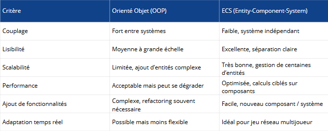

# C6 : Veille Technologique & Accessibilité

## 🔎 Observable 1 : Étude comparative

Dans le cadre du projet **R-Type**, plusieurs choix techniques structurants devaient être effectués afin de garantir la performance, la maintenabilité et l’évolutivité du jeu.
Cette étude comparative vise à analyser différentes solutions techniques possibles et à justifier les choix retenus en fonction des contraintes du projet.

---

### 1. Choix de la bibliothèque graphique – Client

Côté client, nous avions besoin d’une bibliothèque capable de gérer le rendu 2D temps réel, les entrées utilisateur et l’audio, tout en restant compatible Linux et Windows, et suffisamment performante pour un jeu réseau.

	
	 <em>Comparatif des bibliothèques graphiques</em>

Nous avons comparé principalement trois bibliothèques : SFML, SDL2 et Raylib.

**Analyse :** 
SFML offre une API très simple et rapide à prendre en main, mais elle est plus haut niveau et peut être plus limitante pour un moteur fortement personnalisé. 
Raylib est très accessible, mais moins mature pour des projets réseau évolutifs. 
SDL2, en revanche, est plus bas niveau, mais offre un contrôle très fin sur le rendu, les entrées et l’audio.

**Choix final :** 
Nous avons choisi SDL2 car elle représente un bon compromis entre performance, portabilité et maîtrise technique. 
Même si elle demande plus de code, elle s’intègre très bien dans une architecture de moteur de jeu et permet une séparation claire entre le rendu, la logique et le réseau.

---

### 2. Architecture du moteur de jeu

Un des enjeux majeurs du projet était la séparation des responsabilités entre les différents systèmes : rendu, logique de jeu et réseau.

	
	 <em>Comparaison des architectures logicielles </em>

Deux approches ont été envisagées : une architecture orientée objet classique et une architecture de type ECS.

**Analyse :** 
L’approche orientée objet est simple à mettre en place, mais elle entraîne rapidement un couplage fort entre les systèmes. 
L’architecture ECS permet au contraire de séparer les données, les comportements et les systèmes, ce qui améliore la lisibilité, la performance et l’évolutivité.

**Choix final :** 
Nous avons donc opté pour une architecture ECS afin de faciliter la gestion d’un grand nombre d’entités, comme les joueurs, les ennemis et les projectiles, tout en gardant un moteur modulaire et extensible. 
Ce choix permet également d’envisager plus facilement l’ajout de nouvelles fonctionnalités avancées par la suite.

---

### 3. Architecture réseau du jeu

Un autre enjeu central du projet était la gestion du réseau, car R-Type repose sur des échanges temps réel entre le serveur et plusieurs clients.

	
	 <em>Comparaison des solutions réseau</em>

Deux approches ont été envisagées :
- une gestion réseau bas niveau avec des sockets “classiques” (TCP/UDP)
- une solution plus abstraite basée sur une bibliothèque dédiée, en l’occurrence Boost.Asio

**Analyse :** 
La gestion des sockets bas niveau permet un contrôle total des échanges, mais elle complexifie fortement le code. Elle demande de gérer manuellement les connexions, les threads, la synchronisation et les erreurs réseau, ce qui augmente le risque de bugs et rend la maintenance plus difficile. 
À l’inverse, Boost.Asio fournit une abstraction robuste pour le réseau asynchrone. Elle permet de gérer efficacement les communications non bloquantes, d’améliorer la lisibilité du code et de faciliter la scalabilité du serveur, tout en restant performante.

**Choix final :** 
Nous avons choisi d’utiliser Boost.Asio pour la partie réseau. 
Ce choix nous permet de mettre en place une communication asynchrone propre et fiable entre le client et le serveur, adaptée aux contraintes du temps réel.

Grâce à Boost.Asio, le code réseau est plus modulaire, plus maintenable et plus simple à faire évoluer, ce qui est essentiel pour un jeu multijoueur comme R-Type. Ce choix s’inscrit également dans une logique de réduction de la dette technique et d’anticipation des évolutions futures du projet.

---

## 🔎 Observable 2 : Identification des technologies adaptées

Dans le cadre du projet R-Type, il était essentiel de choisir des technologies répondant non seulement aux besoins fonctionnels et techniques du jeu, mais aussi aux critères d’accessibilité pour les personnes en situation de handicap (PSH).
Cette étape vise à identifier les outils, bibliothèques et frameworks les plus adaptés, en s’appuyant sur la veille technologique, les standards du secteur et les recommandations réglementaires, afin de garantir une solution pérenne, performante et accessible à tous.

---

### 1. Game Accessibility Guidelines

Les Game Accessibility Guidelines constituent un ensemble de bonnes pratiques reconnues dans l’industrie du jeu vidéo visant à rendre les jeux accessibles au plus grand nombre, notamment aux personnes en situation de handicap (PSH).
Elles couvrent différents types de limitations, notamment visuelles, motrices, auditives et cognitives, et proposent des recommandations concrètes telles que la personnalisation des contrôles, l’adaptabilité de l’interface ou la gestion des contrastes et du son.

Ces guidelines permettent d’anticiper les besoins des joueurs tout en réduisant la dette technique liée à l’accessibilité.

### 2. Adaptations mises en place dans le projet

Dans le cadre du projet R-Type, plusieurs fonctionnalités ont été implémentées afin de respecter ces recommandations :

- Taille des polices ajustable, garantissant une meilleure lisibilité quelle que soit la résolution ou la taille de la fenêtre

- Filtre daltonien, permettant d’adapter les couleurs du jeu pour améliorer la distinction des éléments visuels

- Personnalisation des touches, afin de s’adapter aux contraintes motrices et aux préférences des joueurs

- Fenêtre de jeu redimensionnable, sans impact sur la lisibilité ou la jouabilité

- Ajustement indépendant du volume de la musique et des effets sonores

Ces choix améliorent l’accessibilité visuelle, motrice et auditive, tout en conservant une expérience de jeu cohérente.

### 3. Apport de SDL2 dans l’accessibilité

La bibliothèque SDL2 a joué un rôle central dans la mise en œuvre de ces fonctionnalités.
Elle offre un contrôle fin des entrées clavier, du rendu graphique, de la gestion des fenêtres et de l’audio, ce qui facilite l’implémentation de mécanismes d’accessibilité personnalisables.

De plus, sa portabilité multi-plateforme et sa flexibilité permettent d’adapter l’interface et les interactions sans dépendre de contraintes imposées par un framework trop abstrait.
Le choix de SDL2 s’inscrit ainsi dans une démarche de maîtrise technique, de pérennité et de conformité aux bonnes pratiques d’accessibilité, en accord avec les Game Accessibility Guidelines.