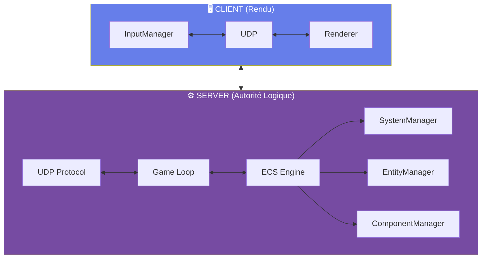
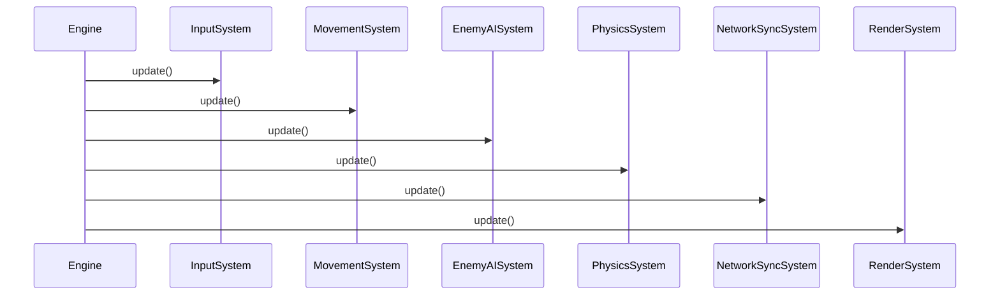
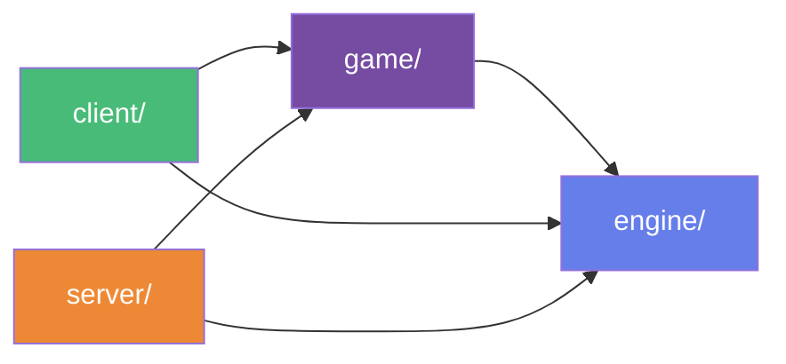

# 🎮 Architecture et Intégration Technique

## 🏗️ Architecture Client/Serveur + ECS

### Pourquoi ECS ?

✅ "Avantages de l'architecture ECS"
  
    === "Découplage"
      **Séparation complète données/logique**
      
      Découplage complet entre données (Composants) et logique (Systèmes) permettant une meilleure gestion des modifications et une plus grande flexibilité dans le développement.

    === "Extensibilité"
      **Ajout facilité de fonctionnalités**
      
      Ajouter une feature = créer un Système + des Composants. Cette approche facilite l'ajout de nouvelles fonctionnalités sans perturber le code existant.

    === "Performance"
      **Optimisation du cache**
      
      Data-oriented design, cache-friendly. L'architecture ECS optimise l'accès aux données, ce qui améliore les performances globales.

    === "Testabilité"
      **Tests isolés**
      
      Chaque système indépendant peut être testé individuellement, ce qui simplifie le processus de débogage.

---

### Structure Logique



ℹ️ "Architecture"
  Cette structure illustre comment le client et le serveur interagissent via un protocole UDP, avec une séparation claire des responsabilités entre le rendu et la logique du jeu.

---

## ⚙️ Pipeline Moteur & Systèmes

### Engine::update() – Le cœur du système

```cpp title="engine/core/Engine.cpp"
void Engine::update() {
  if (!initialized_) return;
  
  time_manager_.update();
  float delta_time = time_manager_.get_delta_time();
  system_manager_.update_all_systems(delta_time);
}
```

🗒️ "Fonction essentielle"
  Cette fonction gère le timing et la mise à jour de tous les systèmes à chaque itération du moteur.

### Ordre d'exécution des systèmes



---

## 🎯 Architecture Technique

### Pattern ECS – Template System<ComponentTypes...>

```cpp title="engine/core/System.hpp"
template <typename... ComponentTypes>
class System : public ISystem {
 public:
  void update(float dt) override {
  for (EntityId e : entity_manager_->get_entities())
    if (has_required_components(e))
    update_entity(e, dt);
  }
};
```

👍 "Fonctionnement"
  Ce modèle permet de définir des systèmes qui traitent uniquement les entités possédant les composants requis, assurant une gestion efficace et type-safe.

### Exemple concret – PlayerMovementSystem

```cpp title="game/systems/PlayerMovementSystem.hpp"
class PlayerMovementSystem : public System<Transform, Velocity, PlayerInput, MovementStats> {
  void update_entity(EntityId e, float dt) override {
  auto* velocity = get_component<Velocity>(e);
  velocity->x += input_.direction_x * dt;
  velocity->y = std::min(velocity->y, max_speed_);
  }
};
```

**Composants requis :** Transform | Velocity | PlayerInput | MovementStats

---

### Injection de Dépendances – SystemManager

```cpp title="engine/core/SystemManager.hpp"
template <typename T, typename... Args>
T* SystemManager::register_system(Args&&... args) {
  auto system = std::make_unique<T>(...);
  system->set_component_manager(&component_manager_);
  system->set_entity_manager(&entity_manager_);
  system->initialize();
  systems_.push_back(std::move(system));
  return system.get();
}
```

| Avantage | Description |
|----------|-------------|
| **Interfaces uniquement** | Les systèmes ne dépendent que des abstractions |
| **Pas de couplage croisé** | Chaque système évolue indépendamment |
| **Lifecycle garanti** | `init → update → shutdown` |

---

### Registry Composants – Allocation Auto

```cpp title="engine/core/ComponentRegistry.hpp"
template <typename T>
class ComponentTypeRegistry {
 public:
  static ComponentTypeId get_type_id() {
  static ComponentTypeId type_id = allocate_component_type_id();
  return type_id;
  }
};
```

✅ "Bénéfice : Extensibilité zéro-coupling"
  
  ✅ **Ajouter un composant = créer une classe**  
  ✅ **Pas de modification du core ECS**  
  ✅ **IDs générés automatiquement et uniques**

---

## 📁 Organisation & Modularité

```plaintext title="Structure du projet"
src/
├── engine/         ← Core ECS
│   └── core/       Engine, System, Component, Entity
├── game/           ← Domaine applicatif
│   ├── components/ Enemy, Player, Health
│   └── systems/    EnemyAI, Movement, Projectile
├── client/         ← Rendu + Input
├── server/         ← Réseau autoritaire
└── common/         ← Partagé client/server
```

**Dépendances unidirectionnelles :**



---

## 🚀 Extensibilité – Ajouter une Feature

➡️ "Scénario : Système de Shield"

  **Étape 1 : Composants**
  ```cpp
  struct Shield { float health; float recharge_rate; };
  ```

  **Étape 2 : Système**
  ```cpp
  class ShieldSystem : public System<Shield, Health> {
    void update_entity(EntityId e, float dt) override {
    auto* shield = get_component<Shield>(e);
    shield->health += shield->recharge_rate * dt;
    }
  };
  ```

  **Étape 3 : Enregistrement**
  ```cpp
  engine_.register_system<ShieldSystem>();
  ```

"✅ Zéro modification du code existant !"
  L'architecture ECS permet une extensibilité optimale sans toucher au cœur du système.

---

## 📊 Patterns Utilisés

| Pattern | Utilisation | Bénéfice |
|---------|-------------|----------|
| **ECS** | Architecture globale | Découplage, performance |
| **Template Metaprogramming** | System<Components...> | Type-safety |
| **Service Locator** | SystemManager | Injection de dépendances |
| **Registry** | ComponentTypeId | Extensibilité sans couplage |
| **RAII** | Lifecycle management | Gestion automatique |
