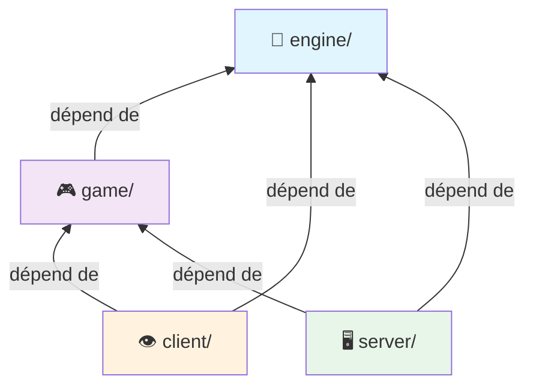

# Architecture Logicielle & Patterns ECS

## Choix d'Architecture

### Architecture Client/Serveur + ECS

#### Justification du pattern ECS

| Avantage | Bénéfice |
|----------|----------|
| 🔀 **Découplage** | Données (Composants) ≠ Logique (Systèmes) |
| 📦 **Extensibilité** | Nouvelle feature = Système + Composants |
| ⚡ **Performance** | Data-oriented design, cache-friendly |
| 🧪 **Testabilité** | Chaque système indépendant et isolable |

#### Schéma Architectural

```
┌──────────────────────────────────────────────────┐
│          CLIENT (Rendu & Entrées)                │
│  InputManager ←→ UDP ←→ Renderer                 │
└──────────────────────────────────────────────────┘
           ↕ Synchronisation
┌──────────────────────────────────────────────────┐
│    SERVER (Autorité Logique - ECS Engine)        │
│                                                  │
│  UDP Protocol ←→ Game Loop ←→ ECS Engine         │
│                              ├─ SystemManager    │
│                              ├─ EntityManager    │
│                              └─ ComponentManager │
└──────────────────────────────────────────────────┘
```

---

## Pipeline Moteur

### `Engine::update()` – Cœur du Système

**Séquence d'exécution garantie:**

```cpp
void Engine::update() {
  if (!initialized_) return;
  
  // 1️⃣ Mise à jour du timing
  time_manager_.update();
  float delta_time = time_manager_.get_delta_time();
  
  // 2️⃣ Exécution de tous les systèmes (ordre déterministe)
  system_manager_.update_all_systems(delta_time);
  
  // 3️⃣ Cleanup automatique des entités marquées
}
```

#### Ordre d'Exécution des Systèmes

```mermaid
graph LR
  A["1. InputSystem"] → B["2. MovementSystem"]
  B → C["3. EnemyAISystem"]
  C → D["4. PhysicsSystem"]
  D → E["5. NetworkSyncSystem"]
  E → F["6. RenderSystem<br/>(Client Only)"]
```

---

## Pattern ECS - Implémentation

### Template System<ComponentTypes...>

```cpp
template <typename... ComponentTypes>
class System : public ISystem {
 public:
  void update(float dt) override {
  for (EntityId e : entity_manager_->get_entities())
    if (has_required_components(e))
    update_entity(e, dt);  // Traite seulement les entités valides
  }
};
```

#### Exemple Concret – `PlayerMovementSystem`

Cet exemple illustre comment un système filtre et traite les entités:

```cpp
class PlayerMovementSystem : public System<Transform, Velocity, PlayerInput, MovementStats> {
  void update_entity(EntityId e, float dt) override {
  // Récupère les composants requis
  auto* transform = get_component<Transform>(e);
  auto* velocity = get_component<Velocity>(e);
  auto* input = get_component<PlayerInput>(e);
  
  // Applique la physique
  velocity->x = input->x * movement_speed_;
  transform->x += velocity->x * dt;
  
  // Clamp aux limites
  transform->x = std::clamp(transform->x, 0.f, screen_width_);
  }
};
```

------

## Intégration Technique

### Gestion du Lifecycle & Injection de Dépendances

**Approche Service Locator léger via SystemManager:**

```cpp
template <typename T, typename... Args>
T* SystemManager::register_system(Args&&... args) {
  auto system = std::make_unique<T>(std::forward<Args>(args)...);
  
  // Injection des dépendances
  system->set_component_manager(&component_manager_);
  system->set_entity_manager(&entity_manager_);
  
  // Hook d'initialisation
  system->initialize();
  
  systems_.push_back(std::move(system));
  return system.get();
}
```

#### Avantages de cette Approche

✅ **Couplage Minimal** – Systèmes ne dépendent que des interfaces  
✅ **Extensibilité** – Pas de dépendance croisée entre systèmes  
✅ **Lifecycle Garanti** – Séquence init → update → shutdown maîtrisée  

---

### Registry Composants – Allocation Automatique des Type IDs

```cpp
template <typename T>
class ComponentTypeRegistry {
 public:
  static ComponentTypeId get_type_id() {
  // 🔐 Thread-safe : variable locale statique
  static ComponentTypeId type_id = allocate_component_type_id();
  return type_id;
  }
};

inline ComponentTypeId allocate_component_type_id() {
  static ComponentTypeId next_id = 0;
  return ++next_id;  // Incrémentation atomique
}
```

#### Bénéfice : Extensibilité Zéro-Couplage

| Action | Impact |
|--------|--------|
| Créer une classe composant | Type ID généré automatiquement |
| Modifier le code core ECS | ❌ Pas nécessaire |
| IDs uniques et déterministes | ✅ Garanti |

---

## Intégration Serveur

### Initialisation du Serveur de Jeu

```cpp
GameServer::GameServer(Asamio::IoContext& io, uint16_t port)
  : socket_(io, UdpEndpoint(UdpProtocol::v4(), port)) {
  
  engine_.initialize();
  
  // Enregistrement des systèmes
  movement_system_ = engine_.register_system<MovementSystem>();
  enemy_ai_system_ = engine_.register_system<EnemyAISystem>();
  physics_system_ = engine_.register_system<PhysicsSystem>();
  network_system_ = engine_.register_system<NetworkSyncSystem>();
  
  startGameLoop();  // Boucle asynchrone UDP
}
```

#### Flux de Traitement Réseau

```
UDP Packet Reçu
    ↓
Validation Headers
    ↓
Parsing Payload
    ↓
Dispatch → Systèmes (Input, Spawn, etc.)
    ↓
Broadcast State Updates → Clients
```

---

## Organisation Modulaire

### Structure des Dossiers par Domaine

```
src/
├── engine/                    ← Infrastructure ECS (zéro dépendance)
│   ├── core/
│   │   ├── Engine.h/cpp
│   │   ├── System.h
│   │   ├── Entity.h
│   │   └── ComponentManager.h
│   └── registry/
│       └── ComponentTypeRegistry.h
│
├── game/                      ← Logique applicative
│   ├── components/
│   │   ├── Transform.h
│   │   ├── Velocity.h
│   │   ├── Enemy.h
│   │   └── Health.h
│   └── systems/
│       ├── MovementSystem.h
│       ├── EnemyAISystem.h
│       └── ProjectileSystem.h
│
├── client/                    ← Rendu + Entrées utilisateur
│   ├── Graphics/
│   │   ├── Renderer.h
│   │   └── InputManager.h
│   └── main.cpp
│
├── server/                    ← Réseau autoritaire
│   ├── GameServer.h/cpp
│   ├── Protocol.h
│   └── RoomManager.h
│
└── common/                    ← Partagé client/server
  ├── Constants.h
  └── NetworkProtocol.h
```

#### Dépendances Unidirectionnelles



---

## Pérennité & Extensibilité

### Ajout d'une Nouvelle Feature : Système de Shield

**Scenario complet (zéro modification du code existant):**

#### Étape 1 : Créer les Composants

```cpp
// components/Shield.h
struct Shield {
  float health = 100.f;
  float max_health = 100.f;
  float recharge_rate = 25.f;  // par seconde
};

struct ShieldRenderer {
  uint32_t shader_id;
  glm::vec3 color;
};
```

#### Étape 2 : Implémenter le Système

```cpp
// systems/ShieldSystem.h
class ShieldSystem : public System<Shield, Health> {
 private:
  NetworkSyncSystem* network_sync_;
  
 public:
  void initialize() override {
  network_sync_ = get_system<NetworkSyncSystem>();
  }
  
  void update_entity(EntityId e, float dt) override {
  auto* shield = get_component<Shield>(e);
  
  // Recharge progressive
  shield->health = std::min(
    shield->health + shield->recharge_rate * dt,
    shield->max_health
  );
  
  // Sync serveur → clients
  if (network_sync_)
    network_sync_->mark_entity_dirty(e);
  }
};
```

#### Étape 3 : Enregistrer dans l'Engine

```cpp
// main.cpp ou GameServer.cpp
engine_.register_system<ShieldSystem>();
```

#### Résultat

| Métrique | Avant | Après |
|----------|-------|-------|
| Lignes modifiées dans engine/ | 0 | 0 |
| Lignes modifiées dans game/ | 0 | 0 |
| Couplage croisé | ❌ | ❌ |
| Testabilité du nouveau code | ✅ | ✅ |

---

## 📊 Résumé des Patterns

| Pattern | Usage | Bénéfice |
|---------|-------|----------|
| **ECS** | Séparation données/logique | Maintenabilité, Performance |
| **Service Locator** | Injection de dépendances | Couplage minimal |
| **Template Registry** | Allocation automatique IDs | Extensibilité |
| **Unidirectional Dependencies** | Architecture modulaire | Testabilité, Isolabilité |

