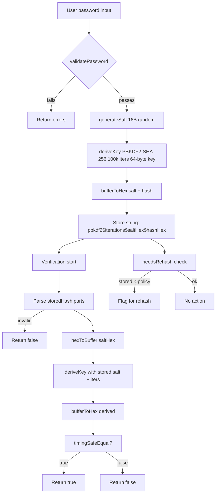

# C24 — Sécuriser l’application web (sessions, erreurs, bonnes pratiques)

## B4 - C24.1 — Sécurité session et données sensibles
- **Validation et rafraîchissement de session** : vérification JWT signée (`AUTH_SECRET`), lookup session en base, purge si expirée, redirections `requireAuth`/`requireAdmin`.

	Pourquoi c’est probant : le cookie signé est vérifié côté serveur, la session est croisée avec la base, toute session expirée est supprimée pour empêcher la réutilisation, et l’accès aux pages protégées redirige systématiquement vers le login.

```ts
// src/lib/auth.ts (extrait)
const token = cookieMap[AUTH_COOKIE_NAME];
const jwtResult = await verifyJWT(token, AUTH_SECRET);
const session = await prisma.session.findUnique({ where: { id: jwtResult.payload.sessionId }, include: { user: true } });
if (session.expiresAt < new Date()) {
	await prisma.session.delete({ where: { id: session.id } });
	return null;
}
export const requireAuth = async () => { const session = await auth.api.getSession({ headers: await headers() }); if (!session) redirect("/login"); return session; };
```

- **Inscription et login sûrs** : validation de mot de passe, hashage, détection doublons, création de session immédiate.

	Pourquoi c’est probant : pas de stockage en clair, contrôle de complexité, rejet des doublons, et provision d’une session immédiatement pour limiter les failles de timing entre inscription et connexion.

```ts
// src/lib/auth/service.ts (extrait signUp)
const existingUser = await this.prisma.user.findUnique({ where: { email: email.toLowerCase() } });
if (existingUser) return { success: false, error: ERRORS.USER_EXISTS };
const hashedPassword = await hashPassword(password);
const user = await this.prisma.user.create({
	data: {
		id: userId,
		email: email.toLowerCase(),
		name,
		accounts: { create: { id: accountId, accountId: email.toLowerCase(), providerId: "credentials", password: hashedPassword } },
	},
});
const sessionResult = await this.createSession(user.id);
```



### Explications detaillees
- Validation initiale: `validatePassword` impose longueur (>=8, <=128) et types de caracteres (minuscule, majuscule, chiffre) pour eviter les mots de passe trop faibles avant meme de les hacher.
- Sel (salt): sequence aleatoire de 16 octets generee par `crypto.getRandomValues`. Le sel est concatene au mot de passe avant PBKDF2 pour rendre chaque hash unique; cela empeche qu'un meme mot de passe produise le meme hash entre utilisateurs et neutralise les tables arc-en-ciel.
- Derivation PBKDF2: `deriveKey` applique PBKDF2-SHA-256 avec 100 000 iterations et une longueur de cle de 64 octets. Les iterations ralentissent les attaques par force brute; la longueur de cle assure une sortie suffisamment grande pour limiter les collisions pratiques.
- Format de stockage: sel et hash sont convertis en hex et ranges dans `pbkdf2$iterations$saltHex$hashHex`. On stocke aussi le nombre d'iterations pour permettre de verifier dans le temps, et le prefixe `pbkdf2` sert d'identifiant d'algorithme.
- Verification: on parse la chaine, on reconstruit le sel et les iterations, on re-applique PBKDF2 sur le mot de passe fourni, puis on compare le hash calcule et le hash stocke via `timingSafeEqual` afin d'eviter les attaques par chronometrage (la comparaison prend toujours le meme temps).
- Rehash: `needsRehash` signale les hashes faits avec un nombre d'iterations devenu inferieur a la politique actuelle. Lors d'une prochaine authentification reussie, on peut re-hacher avec plus d'iterations pour renforcer les comptes sans forcer un reset global des mots de passe.


- **Secrets chiffrés et accès restreint** : `protectedProcedure` impose auth, chiffrement `encrypt(value)`, omission du champ `value` dans les listes.

	Pourquoi c’est probant : l’accès est conditionné à l’utilisateur authentifié, la donnée sensible est chiffrée au repos, et jamais renvoyée dans les réponses listées.

```ts
// src/features/credentials/server/routers.ts (extrait)
create: protectedProcedure
	.input(z.object({ name: z.string().min(1), type: z.enum(CredentialType), value: z.string().min(1) }))
	.mutation(({ ctx, input }) =>
		prisma.credential.create({ data: { name: input.name, userId: ctx.auth.user.id, type: input.type, value: encrypt(input.value) } }),
	),
getMany: protectedProcedure
	.input(z.object({ page: z.number().default(1), pageSize: z.number().min(5).max(50).default(10), search: z.string().default("") }))
	.query(async ({ ctx, input }) => prisma.credential.findMany({
		skip: (input.page - 1) * input.pageSize,
		take: input.pageSize,
		where: { userId: ctx.auth.user.id, name: { contains: input.search, mode: "insensitive" } },
		select: { id: true, name: true, type: true, createdAt: true, updatedAt: true },
	}));
```

## B4 - C24.2 — Gestion robuste des erreurs et protections
- **Validation d’entrée systématique** : Zod bloque payloads invalides/injections, filtre par `userId` pour éviter l’accès croisé.

	Pourquoi c’est probant : empêche les inputs arbitraires, garantit le typage dès l’entrée, et limite l’espace d’attaque par injection ou IDOR (Insecure Direct Object Reference).

```ts
// src/features/credentials/server/routers.ts (extrait validation)
input(z.object({ id: z.string() }))
.query(({ ctx, input }) =>
	prisma.credential.findUniqueOrThrow({ where: { id: input.id, userId: ctx.auth.user.id } }),
);
```

- **Catalogue d’erreurs typées** : erreurs nommées avec codes HTTP adaptés, limite la fuite d’information.

	Pourquoi c’est probant : des erreurs normalisées réduisent le risque de messages verbeux exposant le système et facilitent l’observabilité côté client et monitoring.

```ts
// src/lib/auth/service.ts (extrait)
const ERRORS = {
	INVALID_TOKEN: createError("INVALID_TOKEN", "Invalid or expired token", 401),
	OAUTH_ERROR: createError("OAUTH_ERROR", "OAuth authentication failed", 400),
	ACCOUNT_NOT_FOUND: createError("ACCOUNT_NOT_FOUND", "Account not found", 404),
};
```

- **Journalisation contrôlée des échecs** : `withApiLogging` capture status, tronque le corps de réponse pour ne pas exposer de données, enregistre aussi les exceptions.

	Pourquoi c’est probant : on garde une traçabilité minimale pour diagnostiquer, tout en évitant d’écrire des payloads sensibles en clair dans les logs et en capturant les erreurs serveur.

```ts
// src/lib/request-logger.ts (extrait)
export const withApiLogging = (handler) => {
	return async (req, context) => {
		const startedAt = Date.now();
		let response; let handlerError;
		try { response = await handler(req, context); return response; }
		catch (error) { handlerError = error; throw error; }
		finally {
			const durationMs = Date.now() - startedAt;
			const statusCode = response?.status ?? 500;
			let responseBody = null;
			if (response) {
				const clone = response.clone();
				responseBody = await clone.text();
			} else if (handlerError instanceof Error) {
				responseBody = handlerError.message;
			}
			try {
				await logApiRequest({ method: req.method, path: new URL(req.url).pathname, statusCode, responseBody, durationMs, userAgent: req.headers.get("user-agent") });
			} catch (error) {
				console.error("Failed to persist API request log", error);
			}
		}
	};
};
```
